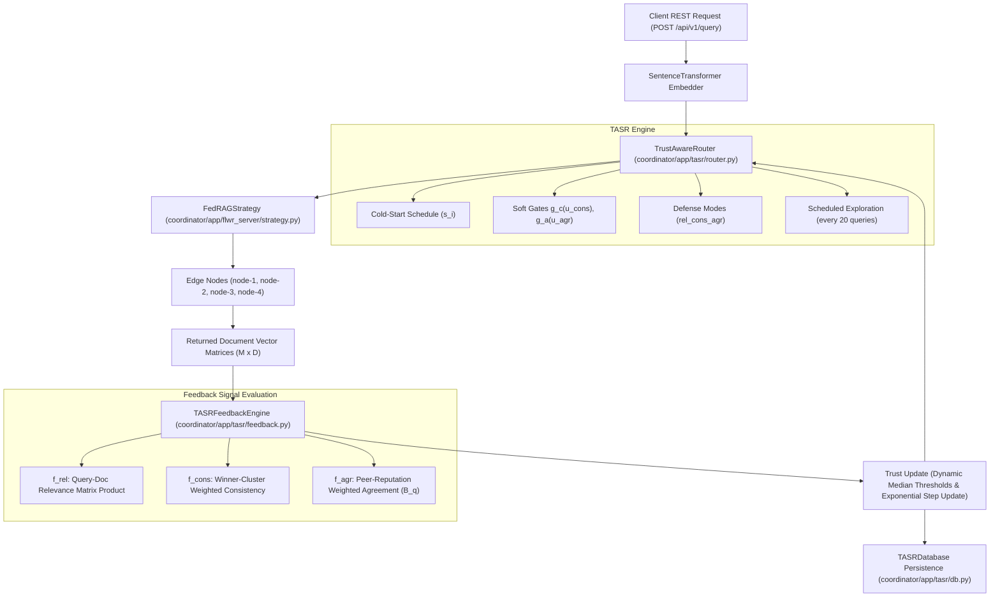

# Implementation Plan: Complete TASR Integration in FedRAG

This implementation plan details the steps to replace the incomplete TASR stubs in `coordinator/app/tasr/` with the canonical, paper-compliant implementation from [`base/fedrag/rag/trust_defense.py`](file:///home/sidharth/Coding/Projects/BTP/base/fedrag/rag/trust_defense.py).

## System Architecture Overview



---

## User Review Required

> [!IMPORTANT]
> **No Automated Tests Rule**: Per your directive, automated test runners (`pytest`, `poetry run pytest`) will NOT be invoked. Code correctness will be verified via static code inspection, exact mathematical contract matching against `base/fedrag/rag/trust_defense.py`, and syntax checks.

---

## Proposed Changes

### Component 1: Central TASR Router (`coordinator/app/tasr/router.py`)

#### [MODIFY] [`coordinator/app/tasr/router.py`](file:///home/sidharth/Coding/Projects/BTP/coordinator/app/tasr/router.py)
* Replace existing stubs with the full implementation matching `base/fedrag/rag/trust_defense.py`.
* Provide a `ClientTrustState` wrapper property for backwards compatibility with existing coordinator endpoints (`u_rel`, `u_cons`, `u_agr`, `s_i`, `feedback_count`).
* Support parameter aliases (`decay_gamma`, `recovery_gamma`, `u_min`, `warmup_w`, `cold_start_t`, `exploration_interval`, `k_route`).
* Implement dynamic defense modes (`"none"`, `"rel"`, `"rel_cons"`, `"rel_cons_agr"`), bounded soft-gating $g(x)$, trajectory history tracking, and summary statistics (`get_trust_summary`).

```python
# Key additions to coordinator/app/tasr/router.py:
class ClientTrustState:
    def __init__(self, node_id: str, router: "TrustAwareRouter") -> None:
        self.node_id = str(node_id)
        self._router = router

    @property
    def u_rel(self) -> float:
        return self._router.reputation.get(self.node_id, 1.0)
    ...
```

---

### Component 2: Vectorized Feedback Engine (`coordinator/app/tasr/feedback.py`)

#### [MODIFY] [`coordinator/app/tasr/feedback.py`](file:///home/sidharth/Coding/Projects/BTP/coordinator/app/tasr/feedback.py)
* Update `TASRFeedbackEngine` methods to match the exact mathematical formulations from `base`:
  1. `calculate_relevance`: Fully vectorized matrix dot product $\text{mean}(D_{\text{returned}} \cdot q)$.
  2. `calculate_consistency`: Winner sub-cluster reweighting ($\rho = 0.6$ for $k^* = \arg\max_k P_k \cdot q$).
  3. `calculate_cross_client_agreement`: Median relevance qualification $B_q = \{i \mid f_{\text{rel}, i} \ge \theta_{\text{rel}}\}$, document centroid unit normalization $\bar{d}_i$, and peer-reputation weighted cosine similarity.

---

### Component 3: Trust State Persistence (`coordinator/app/tasr/db.py`)

#### [MODIFY] [`coordinator/app/tasr/db.py`](file:///home/sidharth/Coding/Projects/BTP/coordinator/app/tasr/db.py)
* Implement `TASRDatabase` class for saving and loading trust states and trajectory histories to `workspace/tasr_state.json`.

---

### Component 4: Edge Node Profile Messaging & Registration (`nodes/app/main.py` & `coordinator/app/flwr_server/strategy.py`)

#### [MODIFY] [`nodes/app/main.py`](file:///home/sidharth/Coding/Projects/BTP/nodes/app/main.py)
* Include `centroid`, `profile_centroids`, `doc_embeddings` sample, and `domain` in `evaluate()` health check metrics so the coordinator receives full profile data when nodes register or heartbeat.

#### [MODIFY] [`coordinator/app/flwr_server/strategy.py`](file:///home/sidharth/Coding/Projects/BTP/coordinator/app/flwr_server/strategy.py)
* Update `aggregate_evaluate` in `FedRAGStrategy` to parse and store node profiles (`centroid`, `profile_centroids`, `doc_embeddings`) in `self._node_registry`.

---

### Component 5: Coordinator REST API Integration (`coordinator/app/api/v1/endpoints.py`)

#### [MODIFY] [`coordinator/app/api/v1/endpoints.py`](file:///home/sidharth/Coding/Projects/BTP/coordinator/app/api/v1/endpoints.py)
* In `POST /api/v1/query`:
  * Register newly connected nodes in `tasr_router` using real centroids and profile centroids retrieved from `flower.get_node_registry()`.
  * Compute feedback signals $f_{\text{rel}}, f_{\text{cons}}, f_{\text{agr}}$ using real document vector matrices and profile centroids.
  * Apply trust score updates and include updated trust telemetry in `QueryResponse`.

---

## Verification Plan

### Automated Verification
* Run static syntax and import checks using `python3 -m py_compile` across all modified files (`coordinator/app/tasr/router.py`, `coordinator/app/tasr/feedback.py`, `coordinator/app/tasr/db.py`, `nodes/app/main.py`, `coordinator/app/flwr_server/strategy.py`, `coordinator/app/api/v1/endpoints.py`).

### Manual Inspection
* Verify signature parity between `TrustAwareRouter` in `base/fedrag/rag/trust_defense.py` and `coordinator/app/tasr/router.py`.
* Verify exact mathematical parity between feedback functions in `base` and `coordinator/app/tasr/feedback.py`.
